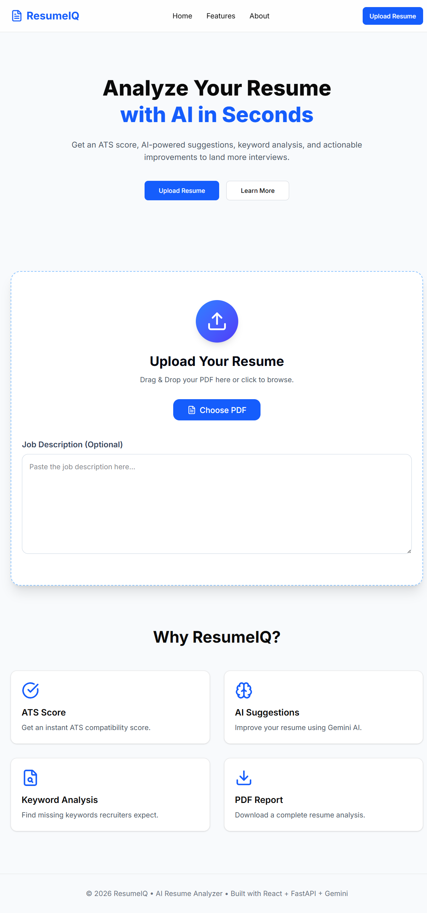
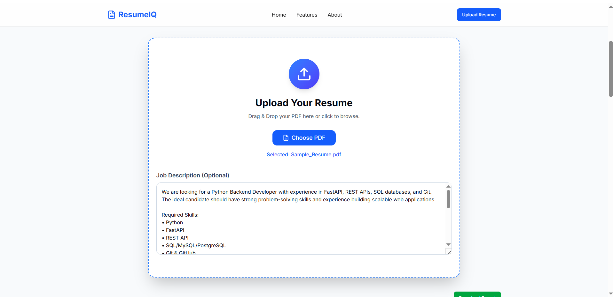
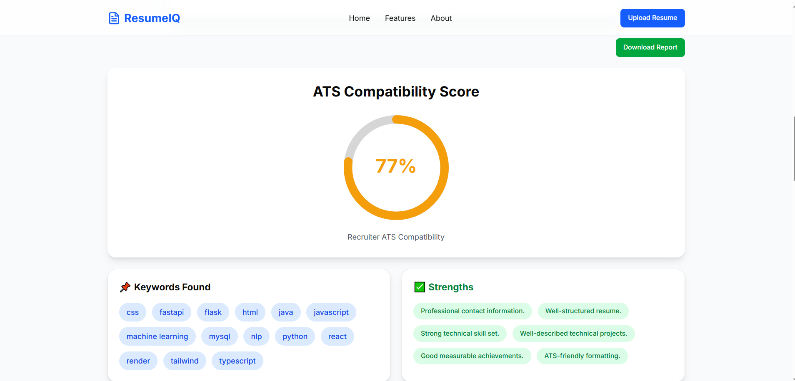
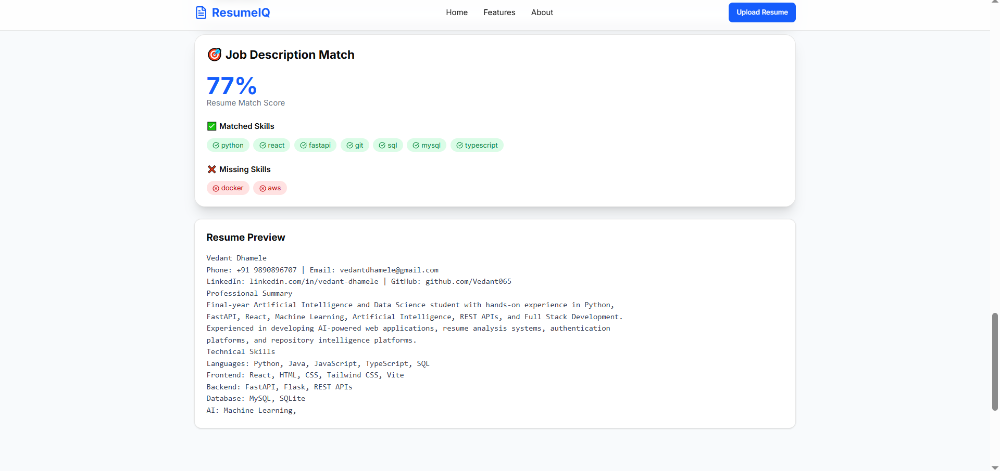
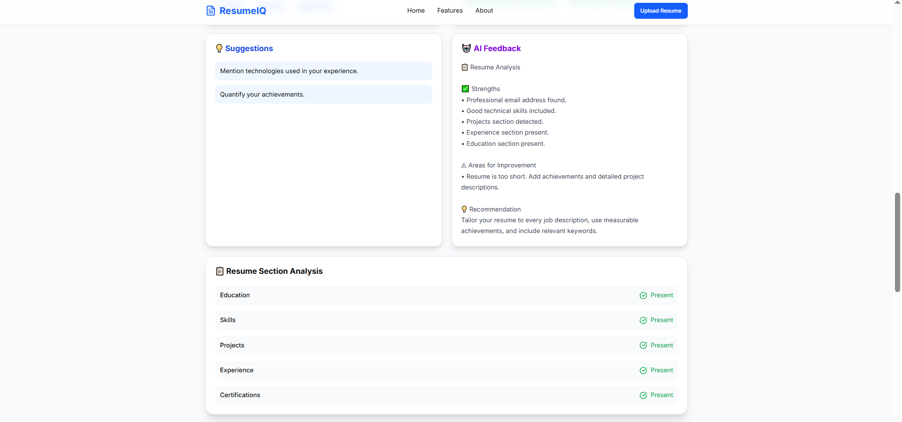

# 📄 ResumeIQ – AI Resume Analyzer

<div align="center">


### AI-Powered Resume Analysis Platform with ATS Scoring, Job Matching, and Personalized Resume Feedback

</div>

---

# 📖 Overview

ResumeIQ is an AI-powered web application that analyzes resumes using Applicant Tracking System (ATS) principles and Artificial Intelligence. It provides an ATS compatibility score, evaluates resume sections, extracts technical skills, compares resumes with job descriptions, and generates personalized improvement suggestions using Google's Gemini AI.

The platform is designed to help students and professionals optimize their resumes for modern recruitment systems.

---

# ✨ Features

## 📊 ATS Resume Analysis

- ATS Score (0–100)
- Resume Rating
- Section-wise Analysis
- Resume Strengths
- Improvement Suggestions
- ATS-Friendly Formatting Check

---

## 💼 Job Description Matching

- Compare Resume with Job Description
- Skill Matching Percentage
- Missing Skills Detection
- Matching Skills Identification

---

## 🤖 AI Resume Review

Powered by Google Gemini AI

Provides:

- Professional feedback
- Resume improvement suggestions
- Content enhancement tips
- Better wording recommendations
- Resume quality analysis

---

## 🧠 Smart Resume Parsing

Automatically extracts:

- Contact Information
- Skills
- Experience
- Projects
- Education
- Certifications

Supports PDF Resume Upload.

---

# 🛠 Tech Stack

## Frontend

- React.js
- TypeScript
- Vite
- Tailwind CSS
- Axios

---

## Backend

- FastAPI
- Python
- PyMuPDF
- Google Gemini API

---

## Deployment

- Frontend → Render
- Backend → Render

---

# 📂 Project Structure

```text
ResumeIQ
│
├── backend
│   ├── app
│   │   ├── api
│   │   │   └── analyze.py
│   │   │
│   │   ├── services
│   │   │   ├── ats.py
│   │   │   ├── parser.py
│   │   │   ├── gemini.py
│   │   │   └── job_match.py
│   │   │
│   │   └── main.py
│   │
│   ├── uploads
│   └── requirements.txt
│
├── frontend
│   ├── src
│   ├── public
│   ├── package.json
│   └── vite.config.ts
│
└── README.md
```

---

# ⚙️ ATS Evaluation Criteria

ResumeIQ evaluates resumes using multiple ATS parameters:

| Parameter | Weight |
|-----------|---------|
| Contact Information | 5 |
| Resume Sections | 10 |
| Technical Skills | 20 |
| Work Experience | 20 |
| Projects | 20 |
| Achievements | 10 |
| Formatting | 10 |
| Resume Length | 5 |

**Total Score = 100**

---

# 🚀 Installation

## Clone Repository

```bash
git clone https://github.com/Vedant065/ResumeIQ.git
cd ResumeIQ
```

---

## Backend Setup

```bash
cd backend

python -m venv venv

venv\Scripts\activate

pip install -r requirements.txt

uvicorn app.main:app --reload
```

Backend runs at

```
http://localhost:8000
```

---

## Frontend Setup

```bash
cd frontend

npm install

npm run dev
```

Frontend runs at

```
http://localhost:5173
```

---

# 🔑 Environment Variables

Create a `.env` file inside the backend folder.

```env
GEMINI_API_KEY=YOUR_GEMINI_API_KEY
```

---

---

# 🚀 Deployment

ResumeIQ is deployed on Render.

| Service | URL |
|---------|-----|
| 🌐 Frontend | https://resumeiq-f.onrender.com |
| ⚙️ Backend API | https://resumeiq-vxg2.onrender.com |

---


# 📡 API Endpoints

## Analyze Resume

```
POST /analyze
```

### Request

- Resume PDF
- Optional Job Description

### Response

```json
{
  "ats_score": 86,
  "rating": "Very Good",
  "keywords_found": [],
  "missing_keywords": [],
  "strengths": [],
  "suggestions": [],
  "section_analysis": [],
  "match_score": 82,
  "matched_skills": [],
  "missing_skills": [],
  "ai_feedback": ""
}
```

---

# 🔄 System Workflow

```text
Resume Upload
      │
      ▼
PDF Parser
      │
      ▼
Text Extraction
      │
      ├────────────► ATS Analyzer
      │
      ├────────────► Job Match Engine
      │
      └────────────► Gemini AI
                │
                ▼
Combined Analysis
                │
                ▼
Results Dashboard
```

---

## 📸 Screenshots

### 🏠 Home Page

The landing page where users can upload their resume and provide a job description for analysis.



---

### 📄 Resume Upload

Users can upload a PDF resume and enter a job description to start the analysis.



---

### 📊 ATS Analysis Dashboard

Displays the ATS score, section-wise evaluation, strengths, weaknesses, and improvement suggestions.



---

### 💼 Job Match Analysis

Compares the resume against the provided job description and highlights the match score, matched skills, and missing skills.



---

### 🤖 AI Resume Feedback

Provides personalized AI-generated recommendations to improve the resume using Google Gemini.


```

---

# 📈 Future Enhancements

- Multi-page Resume Support
- DOCX Resume Upload
- Resume Builder
- Resume Templates
- LinkedIn Profile Analysis
- AI Resume Rewriting
- Interview Question Generator
- Resume Comparison
- Cover Letter Generator
- Recruiter Dashboard

---

# 🎯 Key Highlights

- AI-powered Resume Analysis
- ATS Score Calculation
- Job Description Matching
- Gemini AI Integration
- Modern React UI
- FastAPI Backend
- REST API Architecture
- Resume Parsing
- Skill Extraction
- Section-wise Evaluation

---

# 👨‍💻 Author

**Vedant Dhamele**

LinkedIn

```
https://www.linkedin.com/in/vedant-dhamele
```

GitHub

```
https://github.com/Vedant065
```

---

# 🤝 Contributing

Contributions are welcome.

1. Fork the repository

2. Create a new branch

```bash
git checkout -b feature-name
```

3. Commit changes

```bash
git commit -m "Added feature"
```

4. Push

```bash
git push origin feature-name
```

5. Create a Pull Request

---

# 📜 License

This project is licensed under the MIT License.

---

<div align="center">

⭐ If you found this project useful, please consider giving it a star on GitHub!

Made with ❤️ using React, FastAPI, Python & Gemini AI

</div>
